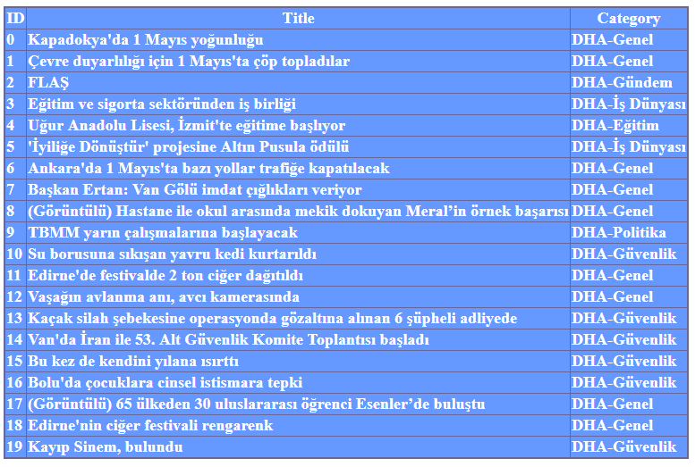

# HW04

## Aim

Design a news crawling website that parse news from a
particular RSS and instantly updates itself.

## Learned Tools & Technologies

- [RSS](http://ajans.dha.com.tr/dha_public_rss.php) [Parse](https://www.codeproject.com/Articles/820669/How-to-Parse-RSS-Feeds-in-NET) with **System.XML**(XmlDocument, XmlNodeList, XmlNode)
- **System.Data** (DataTable, DataRow)
- Gridview and ArrayList **binding**
- Implementing a **Custom Exception Class**
- Logging with **Serilog** (Nuget package).

## Demo

